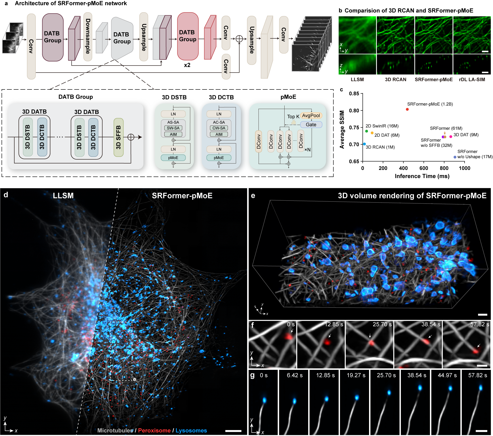
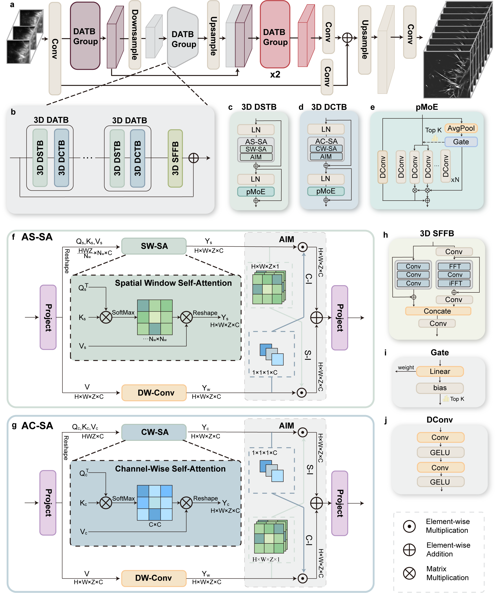
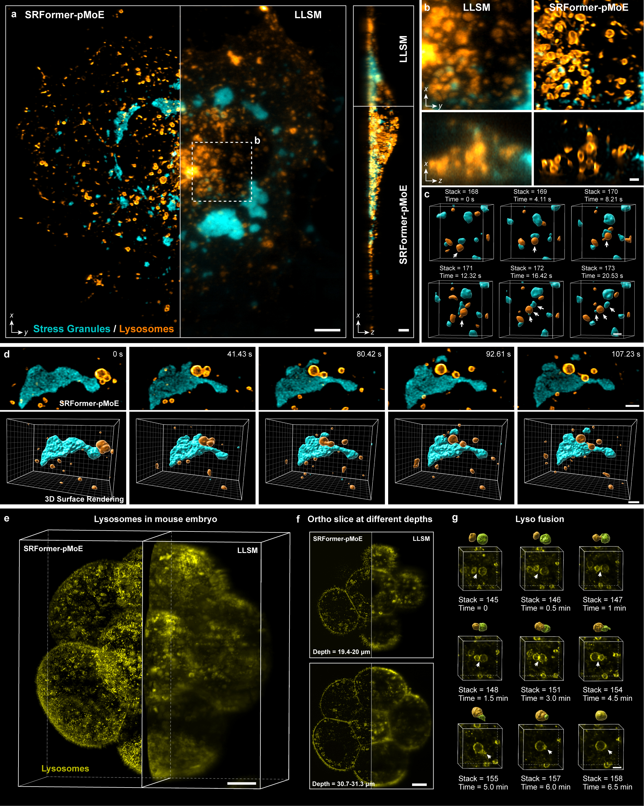
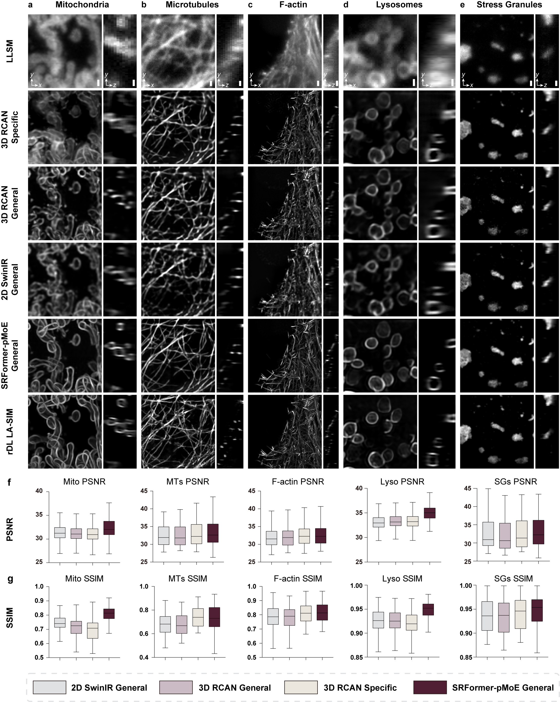
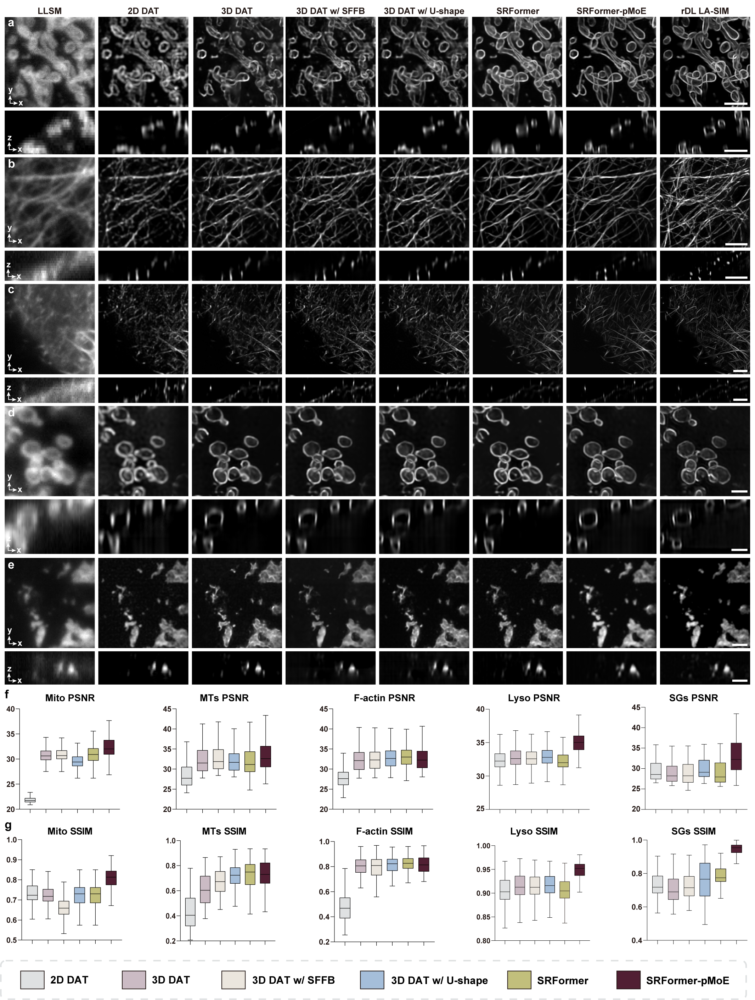
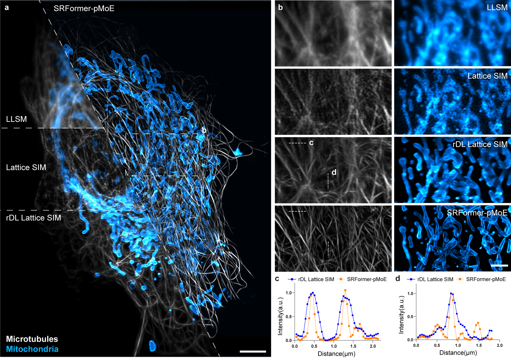
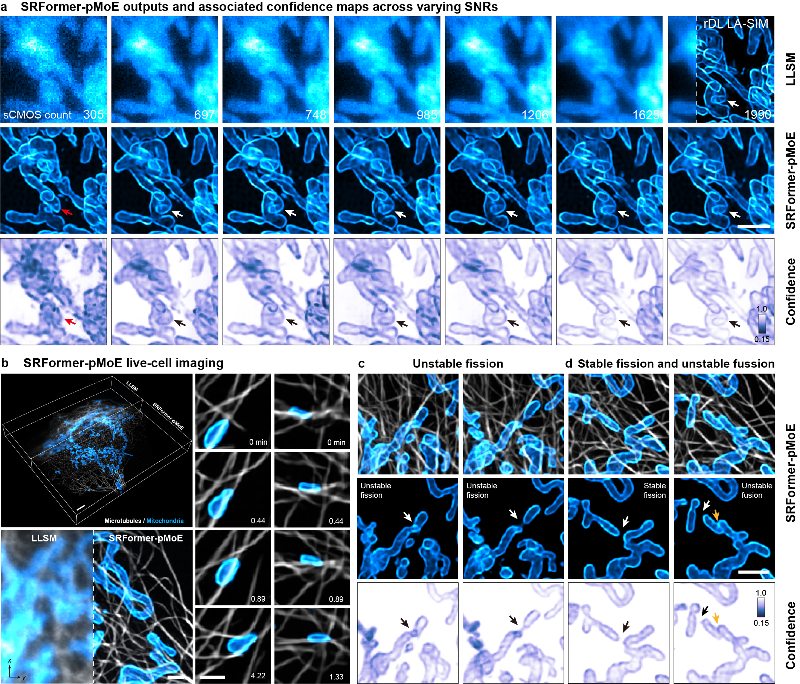

# **SRFormer-pMoE: a 3-D Image SR Backbone Network**
This is a repository of the source codes for paper [*Lattice light sheet activation structured illumination volumetric super-resolution live microscopy*]().


<!-- TOC -->
* ✨ [Method](#Method-Overview)
* ⚙️ [Environment](#Environment)
* 📦 [Demo Data&Pretrained Model](#Demo-Data&Pretrained-Model)
* 💡 [Quick Start](#Quick Start)
* 🔰 [Training](#Training)
* 📊  [Results](#Results)
<!-- TOC -->

<br><br>
<h1 id="Method-Overview">✨ Method Overview</h1>

In this work, we develop Lattice light sheet Activation Structured Illumination Microscopy (LA-SIM)
which allows implementing rationalized deep-learning (rDL) denoising in a self-supervised manner
and enables producing high-quality three-dimensional (3-D) SR images at limited SNR levels.
We utilize the high-quality rDL LA-SIM data to train a large-scale transformer model --- SRFormer-pMoE
that can overcome the inferior properties of rsFPs and enable multi-color long-term volumetric SR imaging. 
We provide here the tutorial of the implementation of SRFormer, including the environment configuration
and the source code of SRFormer-pMoE.

[](fig/Fig4.png)

*SRFormer-pMoE enables multicolor, long-term 3D super-resolution live imaging.*


<br><br>
<h1 id="Environment">⚙️ Environment</h1>

The cource codes were mainly constructed by Python and PyTorch under an environment of:

```text
python==3.8
pytorch==2.1
cuda==12.1
```
You can install the Pytorch packages by

```shell
pip3 install torch torchvision
```
The necessary packages are contained in the _./requirement.txt_ file. You can install them by
```shell
pip install -r ./requirements.txt
```

<br><br>
<h1 id="Demo-Data&Pretrained-Model">📦 Demo Data&Pretrained Model</h1>

We have provided __Demo Data__ and __Pretrained Model__ at [Zenodo](https://doi.org/10.5281/zenodo.14609279). 
You can load __Demo Data__ and __Pretrained Model__ from our [Zenodo Dashboard](https://doi.org/10.5281/zenodo.14609279) and save them follow the notes.
```
a. pretrained_model.zip
If you want to run the Demo Case in our source code of SRFormer, please load this file and save it under `./pretrained_model/`.

b. Demo_Data_for_SRFormer.zip
If you want to run the Demo Case in our source code of SRFormer, please load this data and save it under `./data/`.
```

<br><br>
<h1 id="Quick start">💡 Quick start</h1>

The inference script automatically processes all testing data:
`data/*LLSM.tif`:

```shell
python test_SRFormer_pMoE.py
```

With the included examples, the expected outputs are: `data/*_LLSM_SRFormer_pMoE.tif`


<h3 id="Inference configuration">Inference configuration</h3>

Edit `test_SRFormer_pMoE.py` to select the GPU, checkpoint, batch size, or input
glob:

```python
cuda_number = "0"
batch = 2
filelist = sorted(glob.glob("./data/*LLSM.tif"))
```

<h1 id="Training">🔰 Training</h1>

<h3 id="Data organization">Data organization</h3>

Set `train_dir`, `val_dir`, and `test_dir` in
`config/SRFormer_pMoE_train_config.py`. Each dataset root should contain paired
LLSM inputs and rDL LA-SIM ground-truth volumes. The configured relative input
and ground-truth subdirectories must remain aligned one-to-one.

```text
data/LLSM/general_struct/
|-- train_zup/
|   `-- <specimen>/
|       |-- <input_subdirectory>/
|       `-- <ground_truth_subdirectory>/
|-- val_zup/
|   `-- <specimen>/
|       |-- <input_subdirectory>/
|       `-- <ground_truth_subdirectory>/
`-- test_zup/
    `-- <specimen>/
        |-- <input_subdirectory>/
        `-- <ground_truth_subdirectory>/
```

Review and update at least the following settings in
`config/SRFormer_pMoE_train_config.py` before training:

- `device_num`, `main_device_num`, and `device_ids`
- `train_dir`, `val_dir`, and `test_dir`
- `input_dir` and `gt_dir`
- `batch_size`, `nepoch`, `augment_size`, `lr`
- checkpoint intervals: `val_checkpoint` and `save_checkpoint`
- `resume` and `resume_path`

Then run:

```shell
python train_SRFormer_pMoE.py
```


<br><br>
<h1 id="Results">📊  Results</h1>


## Results

### 1. Network architecture of SRFormer-pMoE.

[](fig/sFig9.png)

### 2. Shedding new light on the subcellular dynamics from single-cell to multi-cellular specimens via SRFormer-pMoE.

[](fig/Fig5.png)

### 3. Comparison with state-of-the-art volumetric super-resolution networks

[](fig/eFig7.png)

### 4. Ablation study

[](fig/sFig10.png)

### 5. Comparison with Lattice SIM

[](fig/sFig14.png)

### 6. Long-term super-resolution live imaging with confidence evaluation using Bayesian SRFormer-pMoE

[](fig/eFig8.png)


## Citation

If this code contributes to your work, cite the associated manuscript. Replace
the placeholder fields below with the final journal metadata and DOI when the
paper is published:

```bibtex
@article{dong_lasim,
  title   = {Lattice light sheet activation structured illumination volumetric super-resolution live microscopy},
  author  = {Dong Xue, Meng Quan, Yang Xiaoyu, Chen Haoyu, Qiao Chang, Yuhuan Lin, Siwei Zhang, Xiaohan Geng, Linghui Luan, Tao Jiang, Wenfeng Fu,
Amin Jiang, Wencong Xu, Jiabao Guo, Rongfei Wei, Dong Li},
  journal = {Nature Photonics},
  year    = {2026},
  doi     = {}
}
```

For work specifically using SRFormer-pMoE, also cite the repository or the
corresponding pMoE publication once a formal citation is available.

## License

This project is released under the [MIT License](LICENSE).